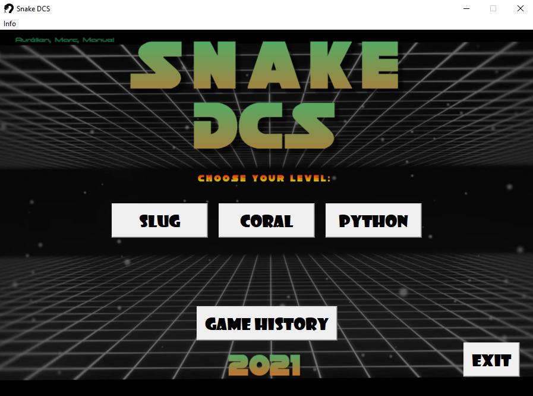
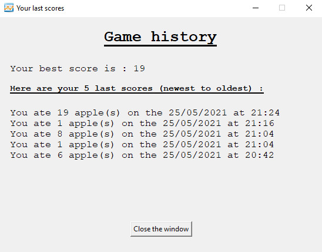
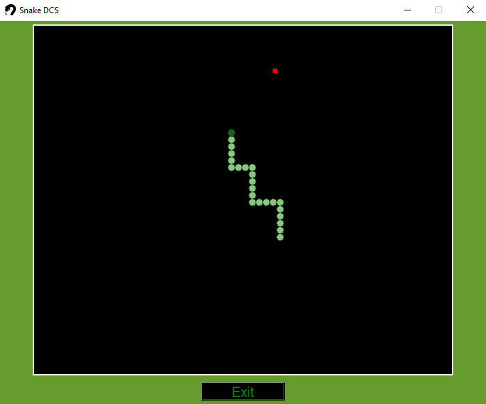

# DCS Snake game 

Snake game as part of a python programming course at the University of Lausanne. 

## Installation for MAC users 

**1. Install [Python 3.7](https://www.python.org/downloads/release/python-370/) (or a newer version) **
Go to the official python website, download and install `python 3.7`. 

**2. Download and Install [pygame](https://www.pygame.org/wiki/GettingStarted) using the Terminal **
Open a `Terminal` window. 
Copy and paste the following line `python3.7 -m pip install --upgrade Pygame` and hit `↵`. 
This should install `pygame 2.0.1` into the python 3.7 folder you've previously installed, if you've downloaded a newer version of python don't forget to adapt the command line according to it. 
(Python 3.7 should come with the `pip` command, if it doesn't work you'll find more information [here](https://pip.pypa.io/en/stable/installing/)) 

**3. Download and Install [pillow](https://pillow.readthedocs.io/en/stable/installation.html) using the Terminal **
Open a `Terminal` window.  
Copy and paste the following line `python3.7 -m pip install --upgrade Pillow` and hit `↵`. 
This should install `pillow 8.0` into the python 3.7 folder you've previously installed. 

**4. Download the code from [github](https://github.com/aurelienHamouti/snake_game) **
Click on the green button and export the `ZIP-file` containing all the code to your computer. 
  
**5. Execute the code **
Unzip the downloaded file. 
Open the `snake_game` folder and right-click on the `snake_game.py` file. 
Select `open with >` **IDLE 3.7**. 
Once the IDLE window is open, go to the `Run menu` and select **Run Module** or press **F5**. 
The game should start. 

## Installation for WINDOWS users 

**1. Install [Python 3.7](https://www.python.org/downloads/release/python-370/) (or a newer version) **
Go to the official python website, download and install `python 3.7`. 

**2. Download and Install [pygame](https://www.pygame.org/wiki/GettingStarted) using the Command Prompt **
Open a `Command Prompt` window. 
Copy and paste the following line `py -3.7 -m pip install --upgrade Pygame` and hit `↵`. 
This should install `pygame 2.0.1` into the python 3.7 folder you've previously installed, if you've downloaded a newer version of python don't forget to adapt the command line according to it. 
(Python 3.7 should come with the `pip` command, if it doesn't work you'll find more information [here](https://pip.pypa.io/en/stable/installing/)) 

**3. Download and Install [pillow](https://pillow.readthedocs.io/en/stable/installation.html) using the Terminal **
Open a `Command Prompt` window.  
Copy and paste the following line `py -3.7 -m pip install --upgrade Pillow` and hit `↵`. 
This should install `pillow 8.0` into the python 3.7 folder you've previously installed. 

**4. Download the code from [github](https://github.com/aurelienHamouti/snake_game) **
Click on the green button and export the `ZIP-file` containing all the code to your computer. 

**5. Execute the code **
Unzip the downloaded file. 
Open the `snake_game` folder and double-click on the `snake_game.py` file. This should start the game. 
If you have different versions of Python on your computer, open **IDLE 3.7**. 
Once the IDLE window is open, go to the `File menu` and select `Open...`. Find the `snake_game.py` file and open it. 
In the new window, go to the `Run menu` and select **Run Module** or press **F5**. 
The game should start. 

## User Manual 

**Game description:** 
You embody a snake and your goal is to eat as much food as you can. The more you eat, the more you will grow... but be carefull not to have eyes bigger than your belly. 

**How to play?** 

   

1. Here you can choose the level of difficulty. If you select `SLUG` the snake will be way slower than in `PYTHON` mode. `CORAL` mode is a good in between. 
2. By clicking on the `GAME HISTORY` button, you have access to your highest score and your five last scores. 

  

3. By clicking on `EXIT` you will quit the game... we don't recommend you to click on this button. 
4. Thanks to the `Info` menu, you have access to the `Game history`, the `User manual`, the `License` and an `Exit` button.

**How to command the snake?** 

   

If you want the snake to go to the left click: `A` or `⭠`. 
If you want the snake to go to the right click: `D` or `⭢`. 
If you want the snake to go up click: `W` or `⭡`. 
If you want the snake to go down click: `S` or `⭣`. 

**When does the game end?**  
When you hit the walls, the game is over. You can click on the `GAME HISTORY` button to see if you were able to set a new record. If you decide to start a new game, your snake will be small again. 

**ENJOY!** 

## License 

Copyright (C) <2021> <Aurélien, Marc, Manuel> 

This program is free software: you can redistribute it and/or modify it under the terms of the GNU General Public License as published 
by the Free Software Foundation, either version 3 of the License, or(at your option) any later version. This program is distributed 
in the hope that it will be useful, but WITHOUT ANY WARRANTY; without even the implied warranty of MERCHANTABILITY or FITNESS FOR A PARTICULAR PURPOSE. 
See the GNU General Public License for more details. You should have received a copy of the GNU General Public License along with this program. 
If not, see http://www.gnu.org/licenses. 
